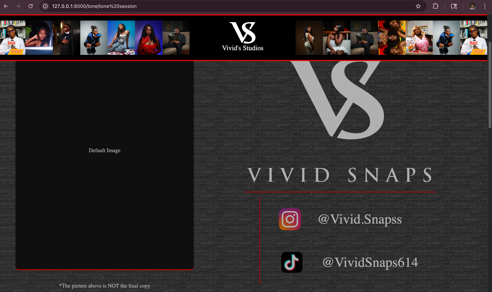
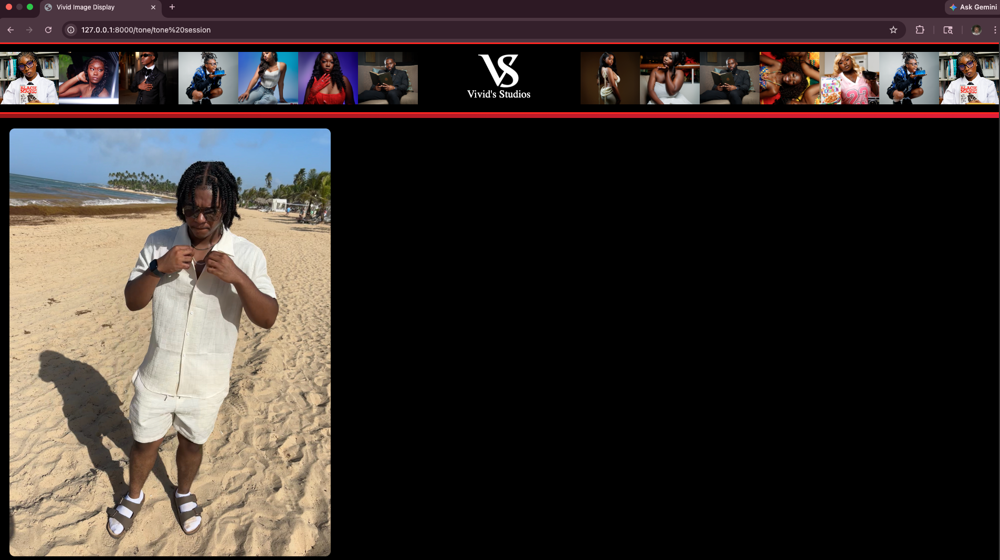
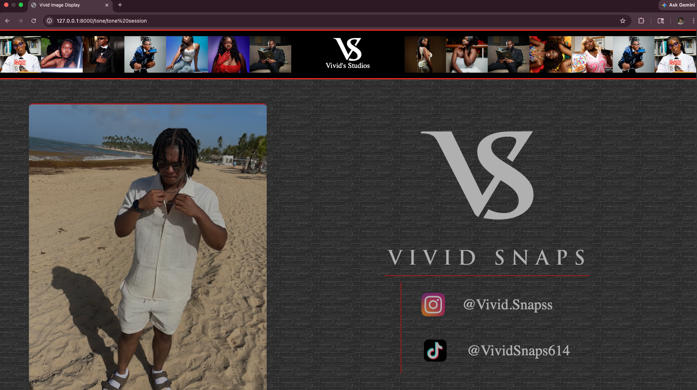
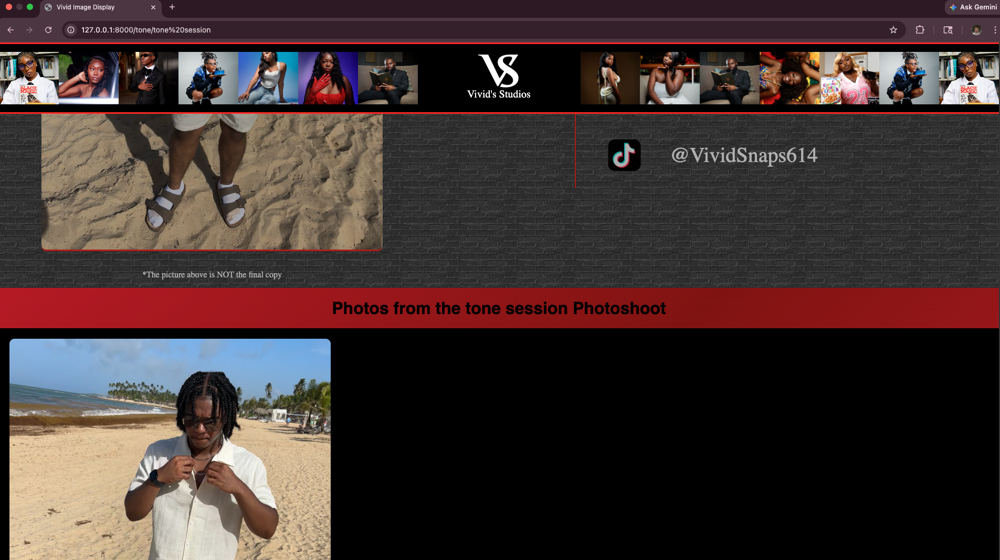

# VividDisplayApp — Real-Time Client Photo Display

## Project Description

VividDisplayApp is a real-time image display system designed for photography sessions and client previews. The application monitors a selected image folder and automatically updates a live gallery interface whenever new photos are captured and written to the session directory.

The project was developed for use with tethered photography workflows and is intended to provide clients with immediate visual feedback during live shoots.

The current implementation supports local image monitoring using JPEG image formats and includes both filesystem event watching and polling-based fallback detection to improve reliability during active sessions.


---

## Screenshots

### Session Selection


### Live Gallery










---


---

## Current Features

- Real-time image updates using WebSockets
- Automatic session folder monitoring
- Live gallery preview interface
- Dynamic image loading without manual page refresh
- Fallback polling system for missed filesystem events
- Duplicate event protection using timed cache filtering
- Automatic favorites folder creation for sessions
- Session and shoot selection interface
- macOS hidden/system file filtering
- Local JPEG image support

---

## Planned Features

- Favorites image selection system
- Client-side image marking and filtering
- Photo counter and session statistics
- Studio branding and theme customization
- Expanded RAW image format support
- External drive compatibility improvements
- Packaged desktop application distribution
- Improved tethered camera workflow testing

---

## Technologies Used

- Python 3.10+
- FastAPI
- WebSockets
- Watchdog
- Jinja2 Templates
- HTML/CSS/JavaScript
- Threading and asynchronous event handling

---

## Installation and Setup

### 1. Clone the Repository

```bash
git clone <repository-url>
cd vivid-gallery-original
```

### 2. Create and Activate a Virtual Environment

```bash
python3 -m venv .venv
source .venv/bin/activate
```

### 3. Install Dependencies

```bash
pip install -r requirements.txt
```

### 4. Run the Application

```bash
python3 main.py
```

The application will launch locally at:

```txt
http://127.0.0.1:8000/select
```

---

## Current Project Status

The application is currently functional for local folder-based JPEG monitoring and live gallery updates.

Testing has primarily been performed using local system folders on macOS. External drive workflows, tethered camera integrations, and additional image formats may require further testing and refinement depending on device behavior and filesystem event handling differences.

---

## Notes

- The project uses both watchdog-based filesystem monitoring and polling fallback detection for improved reliability.
- Duplicate image events are filtered using a timed cache system and frontend duplicate protection.
- macOS hidden files such as `._*` and `.DS_Store` are ignored automatically.

---

## Future Development Goals

- Improve external drive compatibility
- Expand support for additional image formats
- Optimize tethered workflow stability
- Add packaged desktop application support
- Improve frontend gallery interactions
- Add persistent session management
